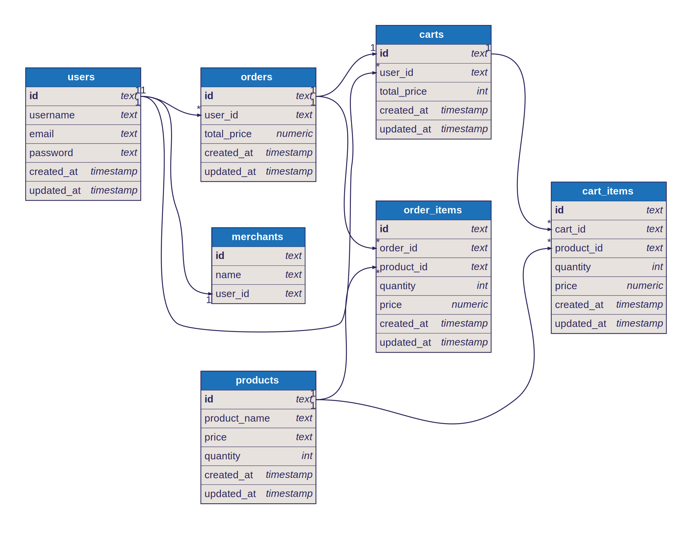

# Hedonify

Hedonify is a scalable micro-services deliver a seamless and smooth shopping experience. Designed for high concurrency and low latency, Hedonify ensures optimal performance and a smooth shopping experience.

## Problem

In multi-user e-commerce environments, a critical challenge arises when multiple customers attempt to purchase the same limited-availability product simultaneously. This scenario creates a race condition where the system must manage conflicting requests to ensure inventory accuracy, transactional integrity, and equitable user access. Failure to resolve this conflict may result in overselling, order cancellations

## Limitation

- This application is not a complete solution for e-commerce.
- It is designed for demonstration purposes only.
    - To demonstrate the concept of micro-services architecture.
    - To demonstrate a strategy how to handle competing user request for ordering the same item.
    - To demonstrate log and tracing.
- This application didn't have any payment gateway integration.
- This application didn't handle expiration.

## Requirements

### Functional Requirements

- List Products: Users can view all available products.
- Order Creation: Users can place an order for products.
- Add to Cart: Users can add products to their cart.

### Non-Functional Requirements

- Scalability: Support high traffic and concurrent users.
- Low Latency: Fast order creation.
- Availability: Ensure uptime around 99.99%.

## Architecture

### Database Schema



### Services Architecture


## Order Creation

When a user places an order, the system first verifies the availability of the products by comparing the available quantity with the desired quantity specified by the user. If the products are available, the system then updates the inventory by reducing the corresponding product quantities. Finally, the order is recorded and stored in the database

### Batch Order Creation

Upon receiving a checkout request, the system inserts it into a queue, where it remains pending until either a predefined timeout is reached or the request aligns with the required batch quantity. Once the batch criteria are met, the order is processed. In the event that a product is found to be out of stock during the processing stage, the corresponding checkout request is removed from the queue and an 'out of stock' error is returned to the user. For further implementation details click this [link](./order/internal/service/order.go).

```go
func (s OrderService) BatchCreateOrder(c context.Context, params []request.CreateOrder) error {
	type mergedOrderItem struct {
		Items               []request.OrderItem `json:"items"`
		OrderedItemQuantity int32               `json:"ordered_item_quantity"`
	}
	mapMergedOrderItem := map[string]mergedOrderItem{}

    // We map the order items to their respective products id
	mapOrder := map[string]request.CreateOrder{}
	productIds := []uuid.UUID{}
	for _, order := range params {
		orderId := order.ID.String()
		_, ok := mapOrder[orderId]
		if !ok {
			mapOrder[orderId] = order
		}
		for _, orderItem := range order.OrderItems {
			productId := orderItem.ProductID.String()
			existing, ok := mapMergedOrderItem[productId]
			if !ok {
				mapMergedOrderItem[productId] = mergedOrderItem{
					Items:               []request.OrderItem{orderItem},
					OrderedItemQuantity: orderItem.Quantity,
				}
				productIds = append(productIds, orderItem.ProductID)
				continue
			}
			existing.OrderedItemQuantity += orderItem.Quantity
			existing.Items = append(existing.Items, orderItem)
			mapMergedOrderItem[productId] = existing
		}
	}

	tx, err := s.pool.BeginTx(c, pgx.TxOptions{})
	if err != nil {
		return err
	}
	defer func() {
		err := tx.Rollback(c)
	}()
	products, err := s.queries.WithTx(tx).FindProductsByIds(c, productIds)
	if err != nil {
		return err
	}

    // Check product quantity and decreased it
	for _, product := range products {
		productId := product.ID.String()
		merged := mapMergedOrderItem[productId]
        // while product quantity is less than the ordered item quantity we need to pop the order item from order and map
		for product.Quantity-merged.OrderedItemQuantity < 0 {
			if len(merged.Items) == 0 {
				break
			}

			lastOrderItem := merged.Items[len(merged.Items)-1]
			merged.OrderedItemQuantity -= lastOrderItem.Quantity
			merged.Items = merged.Items[:len(merged.Items)-1]

			orderId := lastOrderItem.OrderID.String()
			existing := mapOrder[orderId]
            // An int orderItemCount could also worked for efficiency rather than slice
			existing.OrderItems = existing.OrderItems[:len(existing.OrderItems)-1]
			mapOrder[orderId] = existing
		}
		mapMergedOrderItem[productId] = merged
	}

    // Update product quantity in batch
	var sb strings.Builder
	for productId, item := range mapMergedOrderItem {
		sb.WriteString(fmt.Sprintf(`when id = '%s' then %d `, productId, item.OrderedItemQuantity))
	}
	query := fmt.Sprintf(
		`update products set updated_at = now(), quantity = quantity - case %s end where id = any($1::uuid[]) returning *;`,
		sb.String(),
	)
	rows, err := tx.Query(c, query, productIds)
	if err != nil {
		return err
	}
	_, err = pgx.CollectRows(rows, pgx.RowToStructByName[repository.Product])
	if err != nil {
		return err
	}

	insertOrderArgs := []repository.InsertOrdersParams{}
	for _, item := range mapOrder {
        // Skip order with empty items
		if len(item.OrderItems) == 0 {
			continue
		}
		insertOrderArgs = append(insertOrderArgs, repository.InsertOrdersParams{
			ID:     item.ID,
			UserID: item.UserId,
			CreatedAt: pgtype.Timestamptz{
				Time:             time.Now(),
				InfinityModifier: pgtype.Finite,
				Valid:            true,
			},
			UpdatedAt: pgtype.Timestamptz{
				Time:             time.Now(),
				InfinityModifier: pgtype.Finite,
				Valid:            true,
			},
		})
	}
	_, err = s.queries.WithTx(tx).InsertOrders(c, insertOrderArgs)
	if err != nil {
		return err
	}
	insertOrderItemArgs := []repository.InsertOrderItemParams{}
	for _, item := range mapMergedOrderItem {
		for _, orderItem := range item.Items {
			insertOrderItemArgs = append(insertOrderItemArgs, repository.InsertOrderItemParams{
				OrderID:   orderItem.OrderID,
				ProductID: orderItem.ProductID,
				Quantity:  orderItem.Quantity,
				Price: pgtype.Numeric{
					Exp:              orderItem.Price.Exponent(),
					InfinityModifier: pgtype.Finite,
					Int:              orderItem.Price.Coefficient(),
					NaN:              false,
					Valid:            true,
				},
			})
		}
	}
	_, err = s.queries.WithTx(tx).InsertOrderItem(c, insertOrderItemArgs)
	if err != nil {
		return err
	}

    // Since the copyfrom query didn't return inserted Order we need to query the inserted orders to return the response
	orders, err := s.queries.WithTx(tx).GetOrders(c) // Better to filter with the order id
	if err != nil {
		return err
	}
	mapResponseOrder := map[string]response.Order{}
	for _, order := range orders {
		orderId := order.ID.String()
		_, ok := mapOrder[orderId]
		if !ok {
			continue
		}
		orderResponse, err := order.Response()
		if err != nil {
			return err
		}
		mapResponseOrder[orderId] = orderResponse
	}

	err = tx.Commit(c)
	if err != nil {
		var wg sync.WaitGroup
		for _, param := range params {
			wg.Add(1)
			go func() {
				defer wg.Done()
				param.ResultChannel <- response.Result{Order: response.Order{}, Err: err}
			}()
		}
		wg.Wait()
		return err
	}
	logger.Info().Msg("committed transaction")
	span.AddEvent("committed transaction")

	var wg sync.WaitGroup
	for _, param := range params {
		wg.Add(1)
		go func() {
			defer wg.Done()
			orderId := param.ID.String()
			order, ok := mapResponseOrder[orderId]
			if !ok {
				param.ResultChannel <- response.Result{Order: response.Order{}, Err: commonErrors.ErrOutOfStock}
				return
			}
			param.ResultChannel <- response.Result{Order: order, Err: nil}
		}()
	}
	wg.Wait()
	return nil
}
```

## Observability

To ensure observability, we utilize both logging and tracing mechanisms. Logs are generated using the zerolog library, outputting data to the console (stdout) and to files in JSON format. These logs are then scraped by Promtail and stored in Loki. Tracing is implemented through OpenTelemetry, with trace data stored in both Tempo and Jaeger. We leverage Grafana for log visualization and analysis. Additionally, we correlate trace and log data to provide a comprehensive understanding of the system's behavior

## Tech Stack

- Web Service: Go
- Database: PostgreSQL
- Cache: Redis
- Deployment: Docker
- Observability:
    - OpenTelemetry
        - OpenTelemetry Collector
    - Prometheus
    - Grafana
    - Loki
    - Jaeger
    - Tempo
    - Promtail
- Load Test: K6

## Run the application

### Requirements

- Docker
- Docker Compose
- Node.js
- npm
- k6

### Steps

- To run the application, run `docker compose up --build -d`
- To run the load test

```bash
cd k6
npm run build
k6 run ./dist/src/orderCreation.js -v
```

## Things to Improve

- Handle error for non-technical users and hide technical details
- Add metrics to monitor the application
- Implement expiration
    - Simulate expiration
- Implement payment
    - Simulate payment failure
    - Simulate payment success
- Implement cancel order
- Implement shipping
- Implement merchant
    - Only merchant can add products

## License

This project is licensed under the [MIT License](LICENSE). Feel free to use, modify, and distribute the app's code following the terms of this license.
