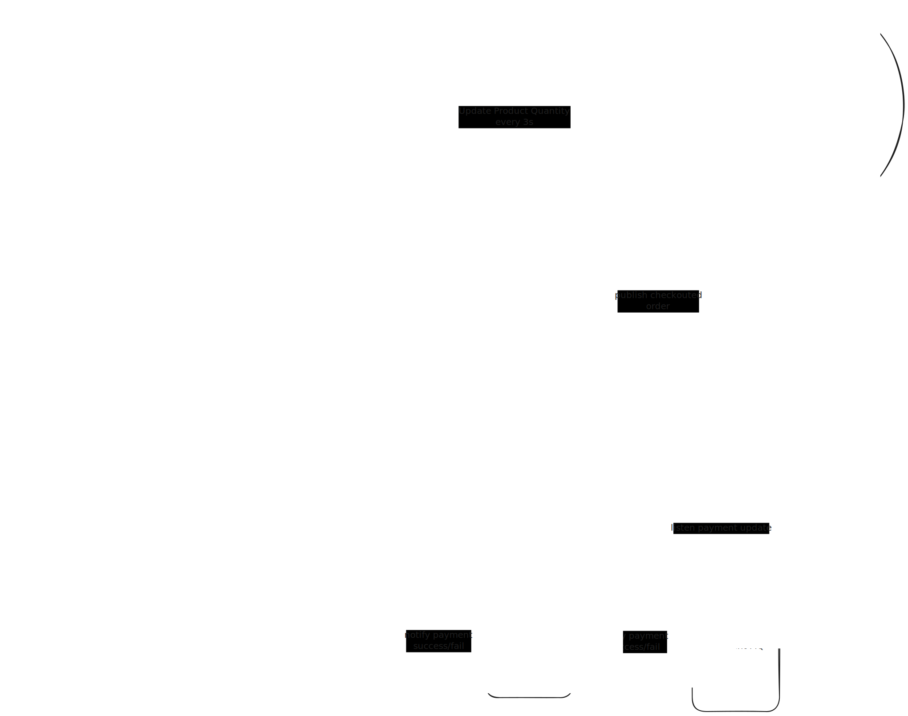

# Hedonify

Hedonify is a scalable micro-services deliver a seamless and smooth shopping experience. Designed for high concurrency and low latency, Hedonify ensures optimal performance and a smooth shopping experience.

## Limitation

- This application is not a complete solution for e-commerce.
- It is designed for demonstration purposes only.
    - To demonstrate the concept of micro-services architecture.
    - To demonstrate a strategy how to handle competing user request for ordering the same item.
    - To demonstrate log and tracing.
- This application didn't have any payment gateway integration.
- This application didn't handle expiration.

## Requirements

### Functional Requirements

- List Products: Users can view all available products.
- Order Creation: Users can place an order for products.
- Add to Cart: Users can add products to their cart.

### Non-Functional Requirements

- Scalability: Support high traffic and concurrent users.
- Low Latency: Fast order creation.
- Availability: Ensure uptime around 99.99%.

## Architecture

### Database Schema

### Services Architecture

## Order Creation

Basically when a user places an order, the system will check products availability by quantity of the product and how many products the user wants to buy then reduce the quantity of the product, lastly create the order in the database.

### Quantity Counter

We hold quantity of each product in cache when a user checkout a cart, the system will check the quantity of the product in the cache and if the quantity is less than the number of products the user wants to buy then the system response an error message telling user that the product is out of stock.

### Batch Sync Periodically

To synchronize the quantity of each category between the cache and the database, we use a publish-subscribe pattern. When a user checkout a cart, the system publishes a message to a message queue, which triggers a background worker to sync the cache with the database.

To prevent worker from updating the same product simultaneously we batch quantity of checkout-ed cart of the same product. This approach minimizes the number of database queries and reduces database write contention.

## Observability

For observability, we have Log and Tracing. Logs are generated using `zerolog` library and printed to the console to stdout and to file with `JSON` format scraped by `Promtail` and stored in `Loki`. Tracing is implemented using `OpenTelemetry` stored in `Tempo` and `Jaeger`. We use `Grafana` to visualize and find log. We connect Trace and Log to provide a better understanding of the system.

## Tech Stack

- Web Service: Go
- Database: PostgreSQL
- Cache: Redis
- Message Queue / PubSub: Redis
- Deployment: Docker
- Observability:
    - OpenTelemetry
        - OpenTelemetry Collector
    - Prometheus
    - Grafana
    - Loki
    - Jaeger
    - Tempo
    - Promtail
- Load Test: K6

## Run the application

### Requirements

- Docker
- Docker Compose

### Steps

- To run the application, run `docker compose up --build -d`

## Things to Improve

- Handle error for non-technical users and hide technical details
- Add metrics to monitor the application
- Implement expiration
    - Simulate expiration
- Implement payment
    - Simulate payment failure
    - Simulate payment success
- Implement cancel order
- Implement shipping
- Implement merchant
    - Only merchant can add products
